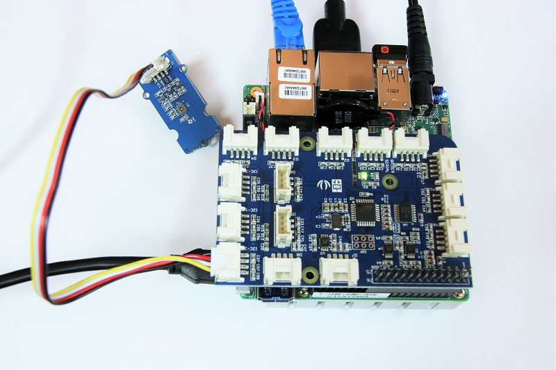

# Grove Temperature and Humidity Sensor
<table>
	<tr>
		<td>Programming language</td>
		<td>C++ (Arduino)</td>
	</tr>
	<tr>
		<td>Skill level</td>
		<td>Beginner</td>
	</tr>
	<tr>
		<td>Time to complete</td>
		<td>5 minutes</td>
	</tr>
	<tr>
		<td>Hardware needed</td>
		<td>UP Squared Grove IoT Development Kit</td>
	</tr>
	<tr>
		<td>Target Operating System</td>
		<td>Ubuntu 16.04</td>
	</tr>
</table>

This tutorial shows you how to use the Grove Temperature and Humidity sensor with the UP²\* board and the UPM library.

## What you'll learn
* How to find the right UPM sensor library for your device
* Instantiate a UPM sensor library class
* How to use the [Delay](https://www.arduino.cc/reference/en/language/functions/time/delay/) function in Arduino
* How to use the [DebugSerial](https://www.arduino.cc/reference/en/language/functions/communication/serial/) function in Arduino

## Gather your materials
* [UP²\* board](http://www.up-board.org/upsquared)
* [GrovePi+](http://wiki.seeedstudio.com/wiki/GrovePi%2b)
* [Grove\* Temperature and Humidity Sensor](https://upm.mraa.io/sensorDetail.html?name=th02)

## Setup
Plug the Grove Temperature and Humidity sensor into any I2C port.



## Get the Code
This example can be found in the Arduino Create\* editor under: Libraries > Default > Up Squared Grove IoT Dev Kit > GroveTemperatureAndHumidity

Open the serial monitor before running the code.

Once the code is running, you should see an initialization message, followed by a temperature reading about every three seconds.


If the code does not run, or reports an error, make sure your temperature and humidity sensor is plugged into an I2C port, and ensure that it isn't loosely plugged in. Ensure that your UP²\* board has an internet connection, and is properly powered.

## How it works
In order for any UPM library to work, you need to include the header file corresponding to that particular sensor in your sketch. Unfortunately, if you browse the Libraries in Arduino Create\* and include the UPM library, all the UPM sensor libraries will be included, and you probably only need one or two out of the several hundred.

The solution is to find your sensor first in the list https://iotdk.intel.com/docs/master/upm/modules.html 

Then copy the name of the .hpp file.

**Note: UPM libraries are generally defined by part number**

At the top of your sketch include it, for example:
```
#include <th02.hpp>
```
To instantiate:
```
upm::TH02 sensor = upm::TH02();
```
## Next Steps & Support
You can find more examples below!
* [Grove Light Sensor](https://github.com/intel-iot-devkit/up-squared-grove-IoT-dev-kit-arduino-create/tree/master/examples/GroveLightSensor)
* [Grove Rotary Angle](https://github.com/intel-iot-devkit/up-squared-grove-IoT-dev-kit-arduino-create/tree/master/examples/GroveRotaryAngle)
* [AWS MQTT Publication](https://github.com/intel-iot-devkit/up-squared-grove-IoT-dev-kit-arduino-create/tree/master/examples/MqttPubAWS)
* [Azure MQTT Publication](https://github.com/intel-iot-devkit/up-squared-grove-IoT-dev-kit-arduino-create/tree/master/examples/MqttPubAzure)

If you need further help, or have a bug/issue to report, you can raise an issue in this github, or look into the [Arduino\* forum](https://forum.arduino.cc/index.php?board=115.0).

For a full list of examples see https://github.com/intel-iot-devkit/upm/tree/master/examples/c%2B%2B

IMPORTANT NOTICE: This software is sample software. It is not designed or intended for use in any medical, life-saving or life-sustaining systems, transportation systems, nuclear systems, or for any other mission-critical application in which the failure of the system could lead to critical injury or death. The software may not be fully tested and may contain bugs or errors; it may not be intended or suitable for commercial release. No regulatory approvals for the software have been obtained, and therefore software may not be certified for use in certain countries or environments.