# MQTT Publication to Amazon Web Services (AWS)\*

This tutorial demonstrates how to use an UP Squared\* board together with the Arduino Create\* IDE to publish messages (sensor data) via MQTT, a messaging protocol suited for IoT applications, to the Amazon Web Services (AWS)\* cloud platform.

**Note**: we use the [aws-iot-device-sdk-cpp.h](https://github.com/intel-iot-devkit/aws-iot-device-sdk-cpp-arduino-create) library (a modified version of the [AWS\* IoT Device SDK](https://github.com/aws/aws-iot-device-sdk-cpp)).  
<table>
	<tr>
		<td>Programming language</td>
		<td>C++ (Arduino)</td>
	</tr>
	<tr>
		<td>Skill level</td>
		<td>Intermediate</td>
	</tr>
	<tr>
		<td>Time to complete</td>
		<td>15 minutes</td>
	</tr>
	<tr>
		<td>Hardware needed</td>
		<td>UP Squared* Grove* IoT Development Kit</td>
	</tr>
	<tr>
		<td>Target Operating System</td>
		<td>Ubuntu 16.04</td>
	</tr>
</table>

## What you'll learn
From this code sample tutorial you'll learn how to:
* Setup an AWS account and a Thing (a representation of a cloud device)
* Create a certificate for your Thing to authenticate your device's connection to AWS IoT
* View MQTT Messages (sensor data) with the AWS IoT MQTT Client

## Gather your materials
### Hardware
* [UP Squared board](http://www.up-board.org/upsquared/) 
* GrovePi+\*
* Grove\* rotary angle sensor
### Software
* [Arduino Create](https://create.arduino.cc/)
* [Latest Ubuntu 16.04 server image](https://downloads.up-community.org/download/up-squared-iot-grove-development-kit-ubuntu-16-04-server-image/)
#### Software dependencies
* libcrypto
* libssl  

**Note**: if you're using the [UP Squared Grove IoT Development Kit](https://software.intel.com/en-us/iot/hardware/up-squared-grove-dev-kit), these software dependencies will already be installed. Otherwise you'll need to install them via apt-get.

## Prerequisites
* [Set up your UP Squared](https://software.intel.com/en-us/upsquared-grove-getting-started-guide)
* [Connect your UP Squared to Arduino Create](https://software.intel.com/en-us/upsquared-grove-getting-started-guide-create-account)

## Before you begin
Complete the sensor setup below. Assuming you've already completed the prerequisites, connect the GrovePi+ to the UP Squared board and then connect the rotary angle sensor to A0 (analog pin 0).

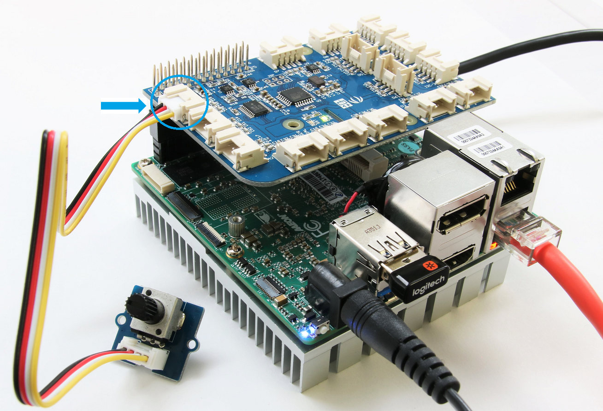

## Tutorial steps
Follow along with the steps below to send data from a rotatry angle sensor (via MQTT) to the AWS cloud platform for viewing.

1. [Set up an AWS account](readme.md#step-1-set-up-an-AWS-account)

2. [Create a Thing](readme.md#step-2-create-a-thing)

3. [Create and attach a policy to your Thing](readme.md#step-3-create-and-attach-a-policy-to-your-thing)

4. [Get the HTTPS endpoint value](readme.md#step-4-get-the-https-endpoint-value)

5. [Get the code](readme.md#step-5-get-the-code)

6. [View data sent via MQTT in the AWS console](readme.md#step-6-monitor-the-topic-in-AWS-IoT-dashboard)

## Step 1: Set up an AWS account

a.  Go to the [AWS IoT console](https://aws.amazon.com/console/) and register or sign in.

b.  In the AWS services search bar, type and select "AWS IoT".

    
c.  Click "Get started"
    
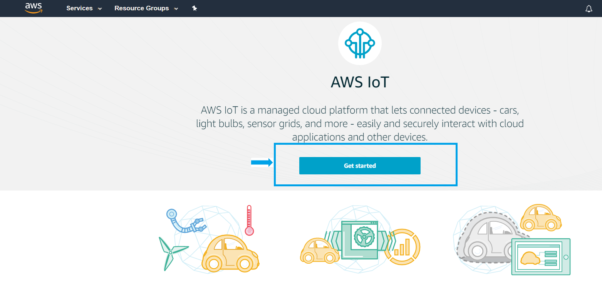
    
## Step 2: Create a Thing
### Register a Thing
A *Thing* is a representation of your device in the cloud.

a.  From  the left navigation panel, choose Manage &gt; Things &gt; and then click on "Register a
    thing"
    
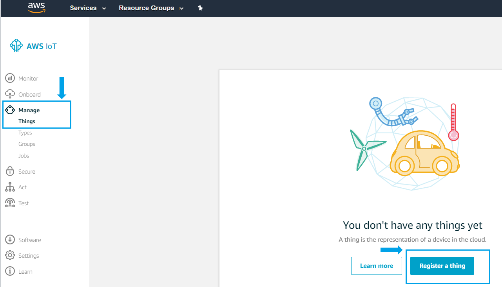
 
b.  To register an AWS IoT Thing, select "Create a singe thing" 

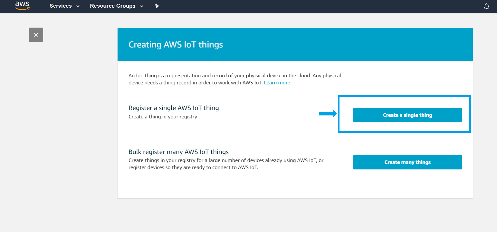

c.  Enter a name for your Thing (for example, "Thingy") and then click "Next" (bottom right hand corner of the screen)

### Add a certificate to your Thing    
a.  Choose "Create certificate" to generate a certificate, public key and private key (used to authenticate your device's connection to AWS IoT).
    

b. Download all four files.

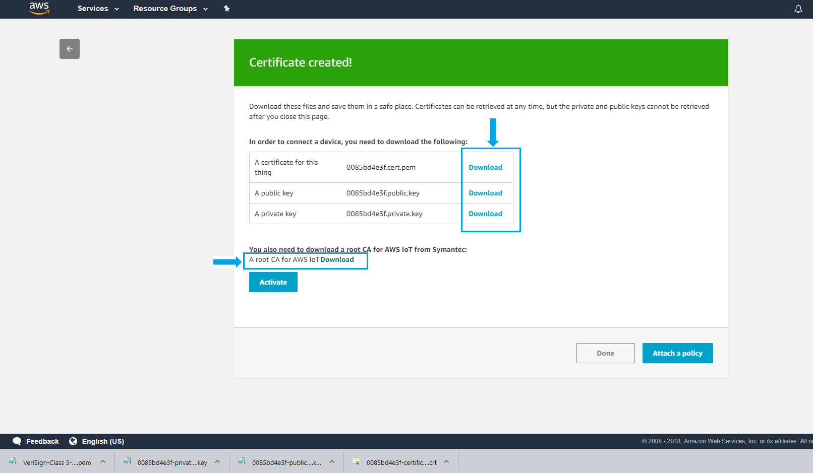

c. And then click ‘Activate’.

    
## Step 3: Create and attach a policy to your Thing
### Create a policy
a. From the navigation pane, choose Secure &gt; Policies &gt; and then click on "Create a policy"

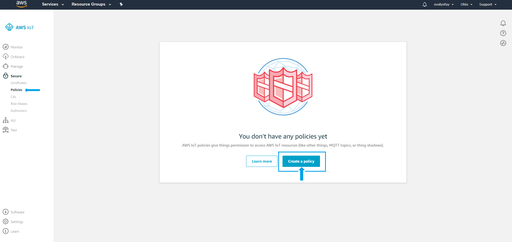

b. Give your policy a name (for example, "my-iot-policy". To "Add statements" choose "iot:\*" for **Action**, "\*" for **Resource ARN** and then select "Allow" for **Effect**. Now click "Create".

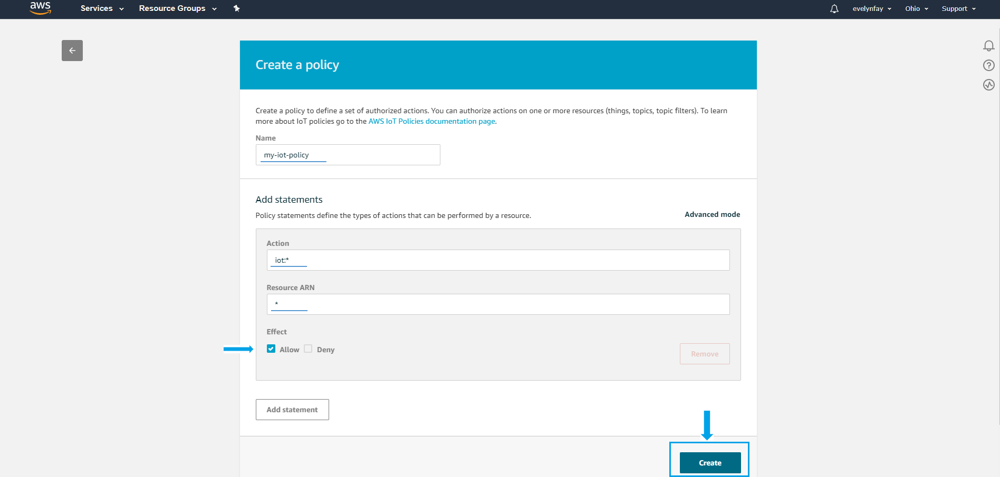

### Attach a policy to your Thing

a. On the main AWS IoT console page, navigate to Manage &gt; Things &gt; and select the Thing you created earlier.

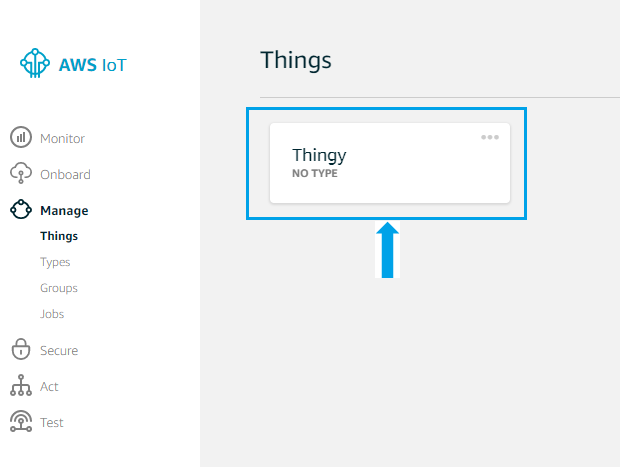

b. Select the "Security" tab and click on the certificate you've attached to your Thing.

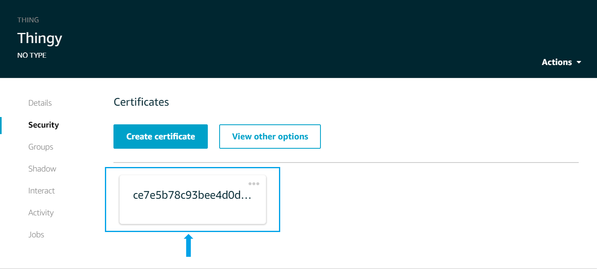

c. From the **Actions** dropdown, select "Attach policy".

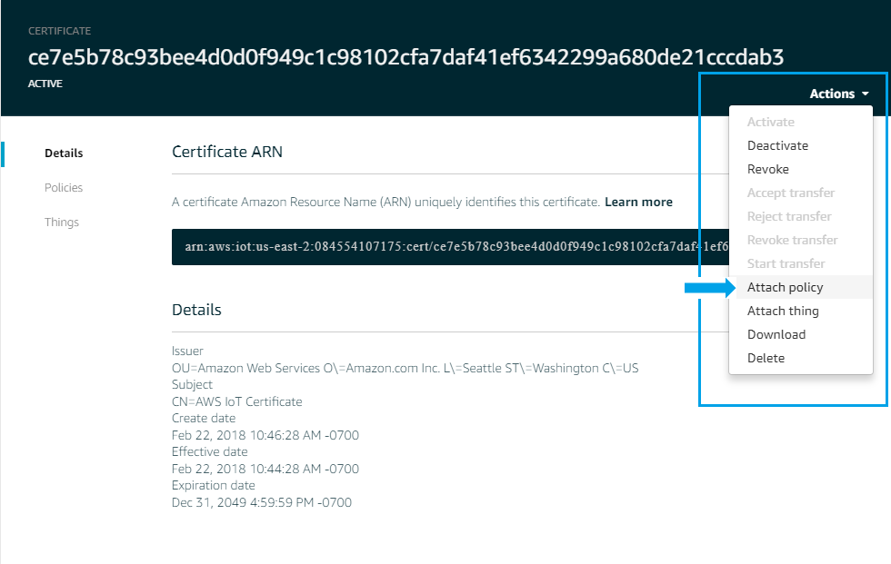

d. Select the policy you created earlier and then click "Attach".

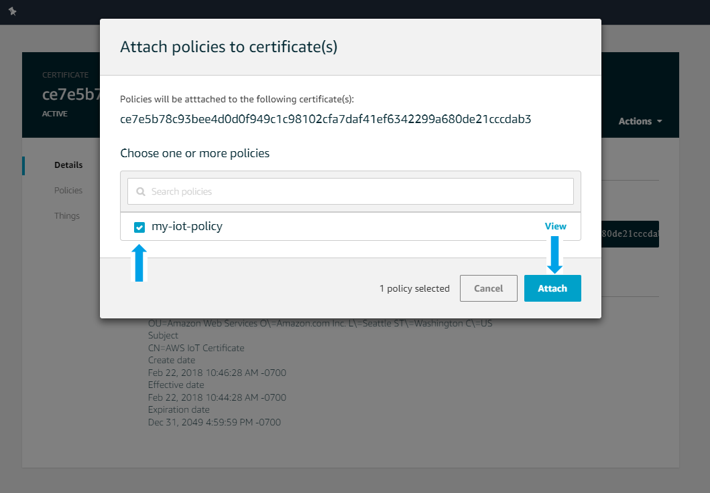

## Step 4: Get the HTTPS endpoint value
You'll need the endpoint value when you modify the code sample in Arduino Create.

7.  In your Thing, select the "Interact" tab and copy the HTTPS endpoint value. This value
    will be used in the sample.

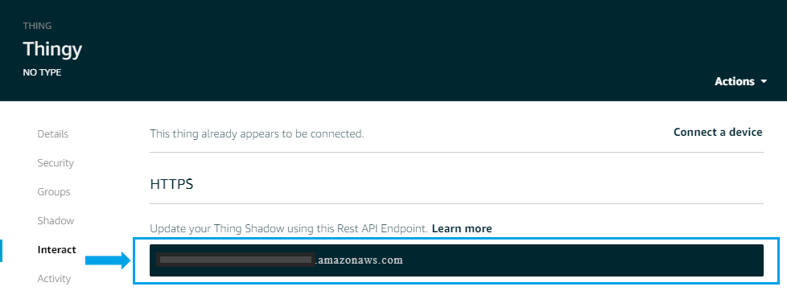

## Step 5: Get the code
a.  Open the MqttPubAWS example in Arduino Create\* **Examples** > **FROM LIBRARIES** > **UP SQUARED GROVE IOT DEV KIT** > **MqttPubAWS**

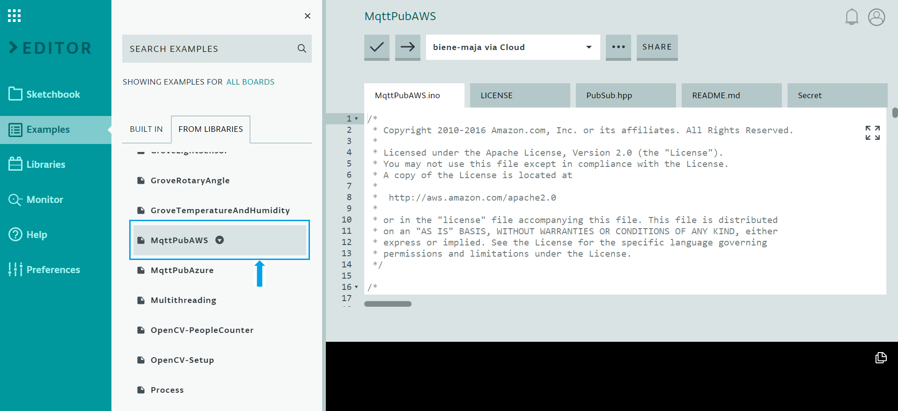

### Modify the code
a.  Enter the endpoint value (`ENDPOINT`), client ID (`CLIENT_ID`) and your Thing's name (`THING_NAME`) in the code sample's \#define.  The client ID and Thing name are same. When you modify the code sample, you'll be prompted to create a copy (click "OK").

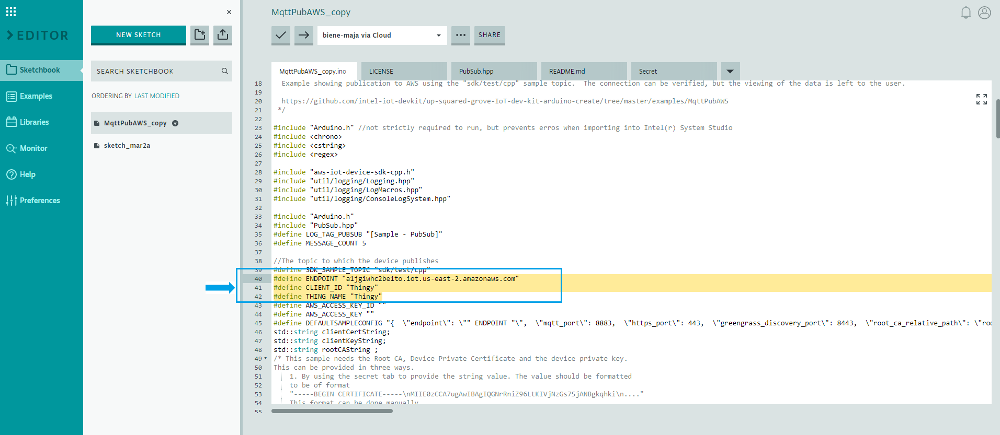

You can also update the sample pub-sub topic (optional).

### Format certificates and keys
To authenticate your UP Squared board's connection to AWS, you'll use the files that were generated when you created a certificate. Find the following files you downloaded earlier on your host computer: 

* xxx-G5.pem
* xxx-certificate.pem.crt
* xxx-private.pem.key

To format the certificates and keys for use in the Arduino Create Secret tab, run the following command on each of the files listed above:

`awk 'NF {sub(/\r/, ""); printf "%s\\n",$0;}' your-certificate.crt`

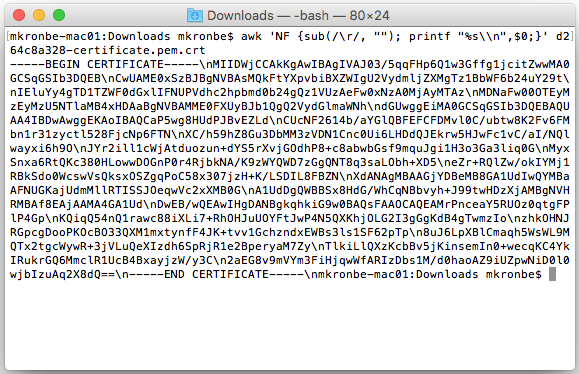

### Secret tab

a.  Once you've properly formatted the files, navigate to the Secret tab. Copy and paste the formatted strings (we recommend using Notepad++\*) to the corresponding entries in the Secret tab.

SECRET\_ROOT\_CA: Content of file ending in `xxx-G5.pem`

SECRET\_CLIENT\_CERT: Content of file ending in `xxx-certificate.pem.crt`

SECRET\_CLIENT\_PRIVATE\_KEY: Content of file ending in `xxx-private.pem.key`

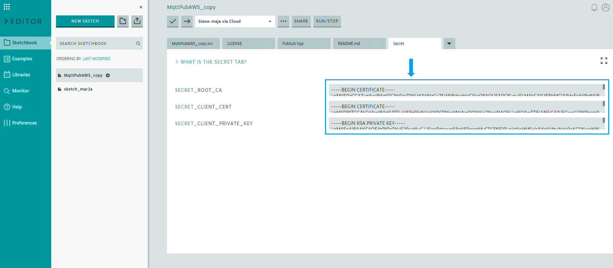

b. Save your file. 

**Note**: For added security, place the root certificate, client certificate and client private key on the device directly by transferring the files to your device (make note of the absolute file name and provide that in the values in the secret path). In the `DEFAULTSAMPLECONFIG` value (line 45), set `"load\_crts\_as\_string"` to false. This loads the certificates from the file paths instead of as strings.

### Subscribe to a topic in AWS IoT console

a. Before you run the example code, go the AWS IoT Console, open the MQTT Test Client and enter "sdk/test/cpp" as the subscription topic. Click "Subscribe to topic".

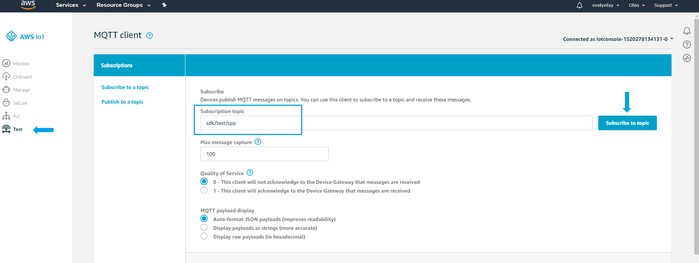

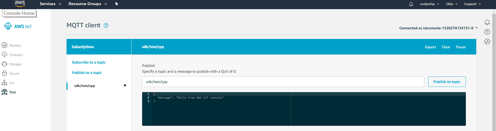

Go back to the Arduino Create environment and open the Serial Monitor (left hand panel of the IDE). The monitor will give you output when you run the example.

### Run the code
Click **Verify** (optional) and then **Upload** to run the code.

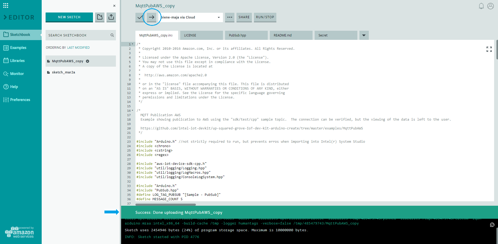

## Step 6: View sensor data

### Monitor the topic in the AWS IoT dashboard

Navigate to AWS IoT MQTT Client and subscribe to "#" if you are not already subscribed. You should see the sensor reading come in on topic /sdk/test/cpp:

