# MQTT with Azure in Arduino Create

## Create an account
If you don't have an Azure account, sign up for a free trial https://azure.microsoft.com/en-us/free/ 

## Create an IoT Hub
You need an IoT Hub to enable communication between Azure and your device. The easiest way to create an IoT Hub is through the Azure portal. Follow the steps in https://docs.microsoft.com/en-us/azure/iot-hub/iot-hub-create-through-portal.

The portal is located at https://portal.azure.com

1. Click "New" and search for "iot"

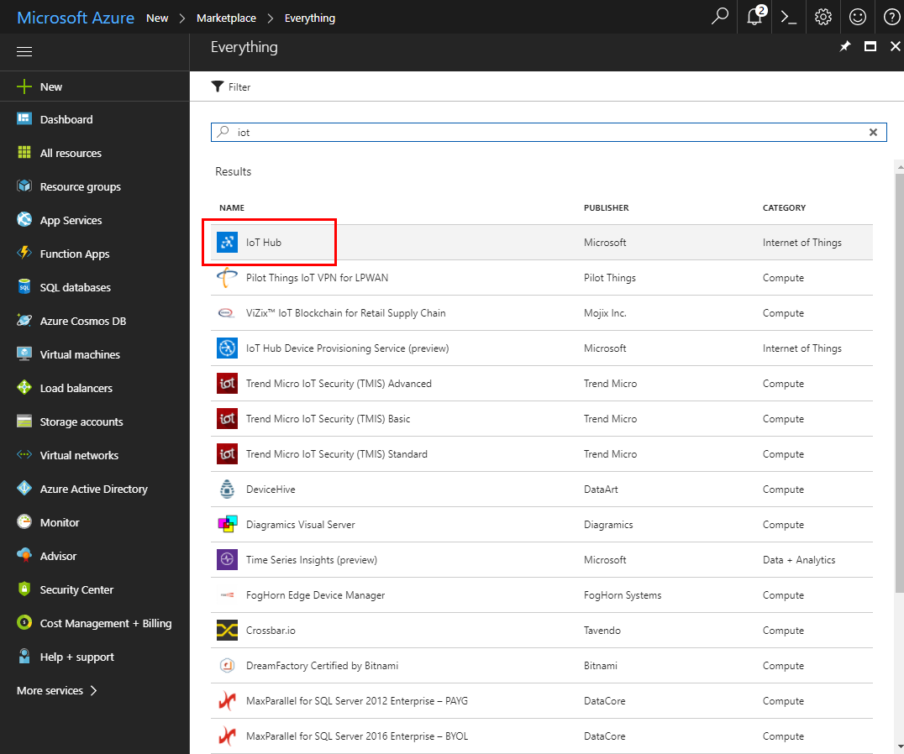

2. Name your hub something unique, for example my-iot-hub###, where ### is some number. It is recommended to use the default settings for the IoT hub creation.

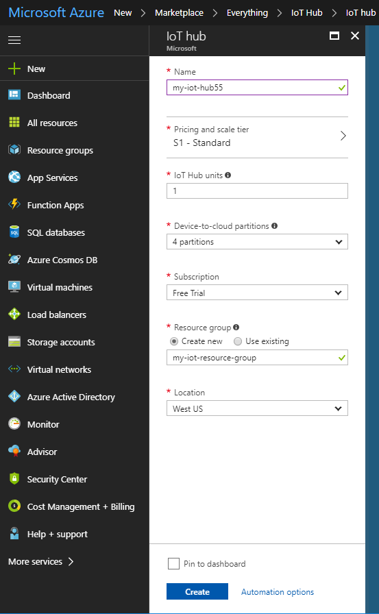

When it is done being created you should see it appear in the Dashboard

## Create a shared access policy

1. Open your hub and select **Shared access policies**, under **SETTINGS**

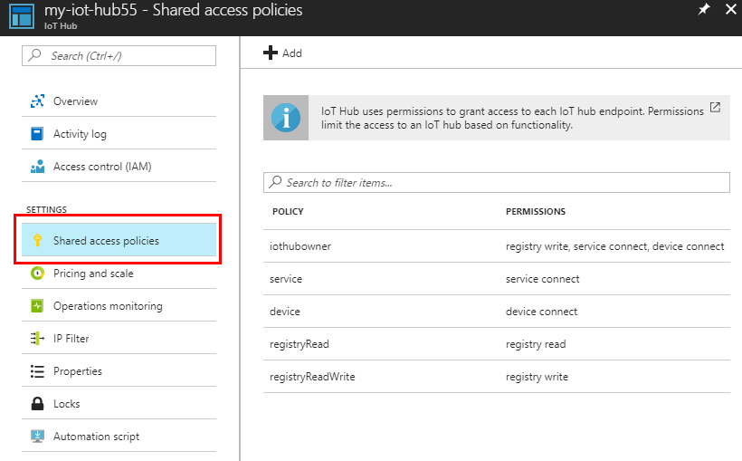

2. Click **Add**

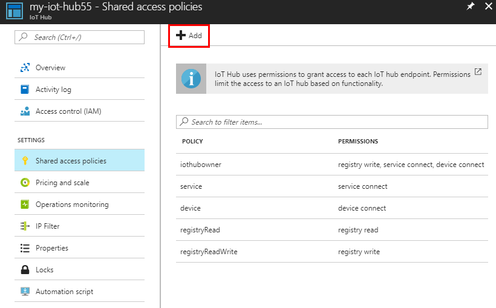

3. Select read, service connect, and device connect permissions.  Give it a name, for example "my-policy"

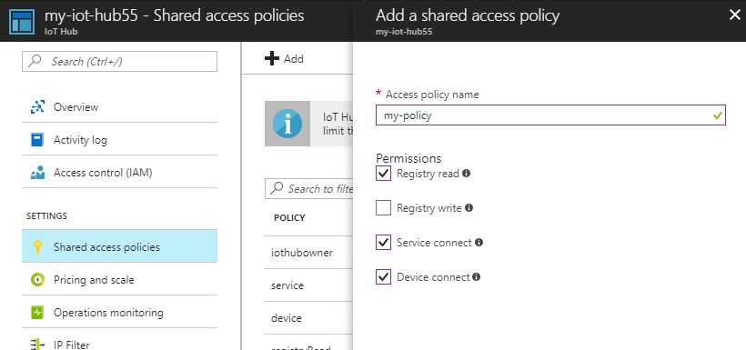

4. The policy you created should now show up under **POLICY**. 

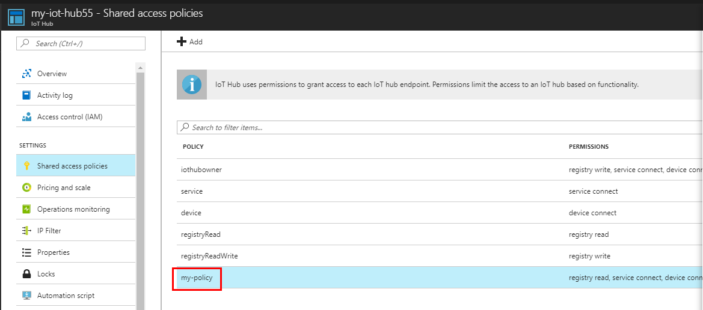

5. Click on your policy, and copy the **Connection string - primary key**, this is also known as the Hub connection string.  You will need it later.

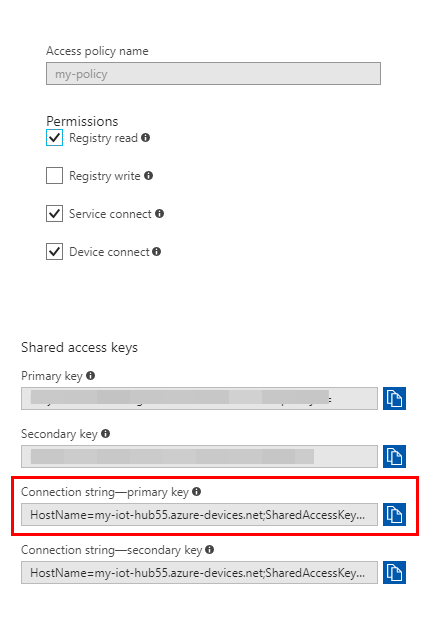

## Setup device explorer

The easiest way to view your data is either using the Device Explorer GUI application (for Windows) or the iot-hubexplorer node.js command line tool (supported on Windows, Mac OS X, and Linux)

This tutorial will you walk you through using the Device Explorer GUI on windows.  See https://github.com/Azure/iothub-explorer for instructions on how to use the iot-hubexplorer node.js command line tool. 

1. Download and install the **SetupDeviceExplorer.msi** from https://github.com/Azure/azure-iot-sdk-csharp/releases.

2. Enter the **Connection string - primary key** you copied from step #5 of the above section into the **IoT Hub Connection String** field in the Configuration tab of the application.  Then click **Update**.  You should see a popup confirming that it was successful.

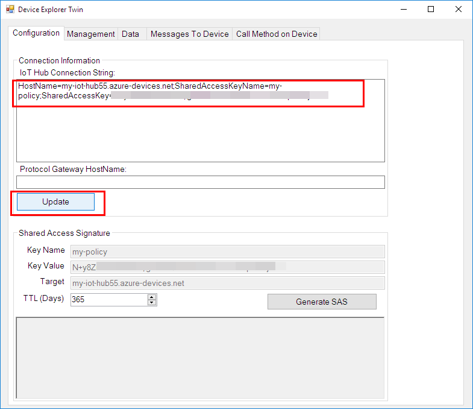

5. Go to the **Management** tab.
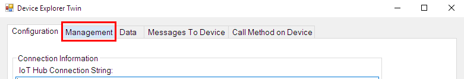

6. Click **Create** and enter a Device ID, for example "test-device".  The Primary and Secondary keys should have populated automatically.

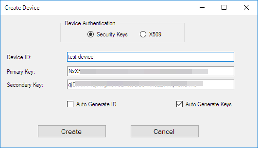

7. Right click on the device you just created, and select **Copy connection string for selected device**

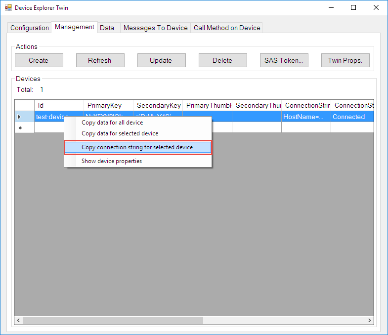

## Edit example in Arduino Create

1. Open the example **Libraries>AZURE IOT DEVICE SDK>Examples>ClientMqtt**

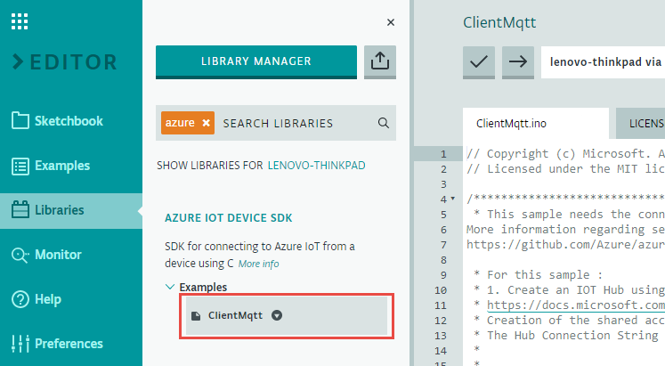

2. Copy the connection string from step #7 above into the Secret tab of the sketch.

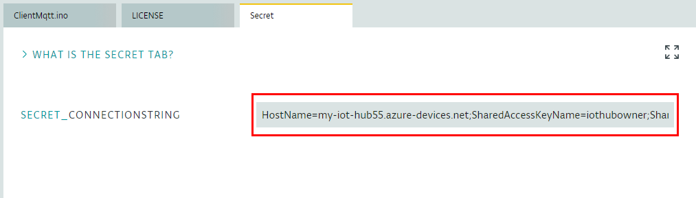

3. Build and Upload the sketch.

## View the data
Go to the **Data** tab and click **Monitor**.  You should see a message saying "Receiving events" or similar.  This is where you will see messages once your application is running on your target.

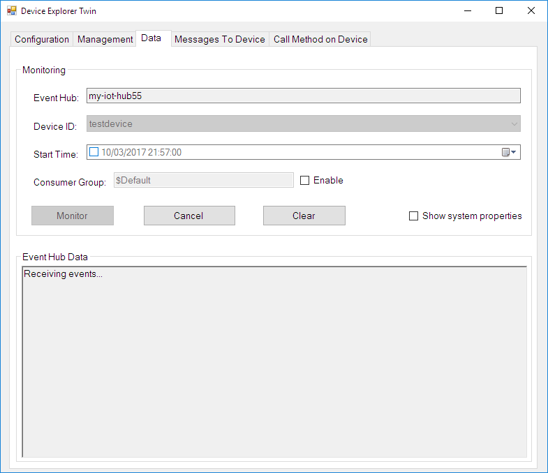

