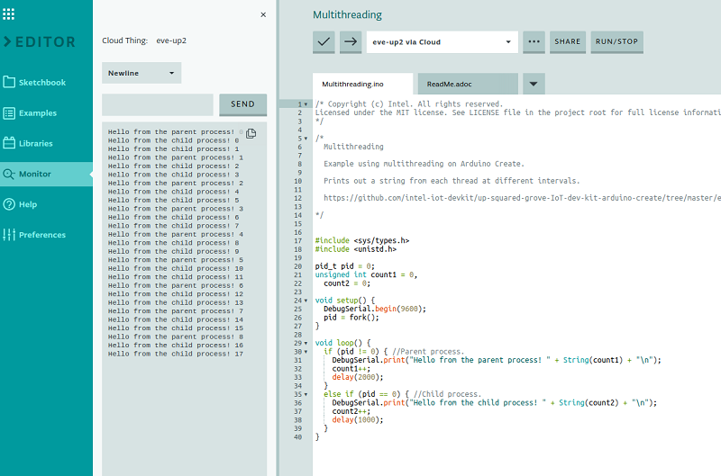

# Multithreading
This tutorial shows you how to use Multithreading on the UP Squared\* board to perform multiple tasks simultaneously.

## What you'll learn
* How to multithread code to multitask within the Arduino Create\* development environment.

## Gather your materials
* [UP Squared\* board](http://www.up-board.org/upsquared)

## Setup
Upload the code to the UP Squared board, then open the serial port (monitor).

## How it works
The "fork" function is a system function included in unix-based operating systems. It can be used to spawn a child process, and returns the process id (pid) of the resulting child. The child's pid variable will contain the initial value, which in this case is preset to "0".

[Fork](http://manpages.ubuntu.com/manpages/trusty/man2/fork.2.html)
[Serial](https://www.arduino.cc/reference/en/language/functions/communication/serial/)

IMPORTANT NOTICE: This software is sample software. It is not designed or intended for use in any medical, life-saving or life-sustaining systems, transportation systems, nuclear systems, or for any other mission-critical application in which the failure of the system could lead to critical injury or death. The software may not be fully tested and may contain bugs or errors; it may not be intended or suitable for commercial release. No regulatory approvals for the software have been obtained, and therefore software may not be certified for use in certain countries or environments.
