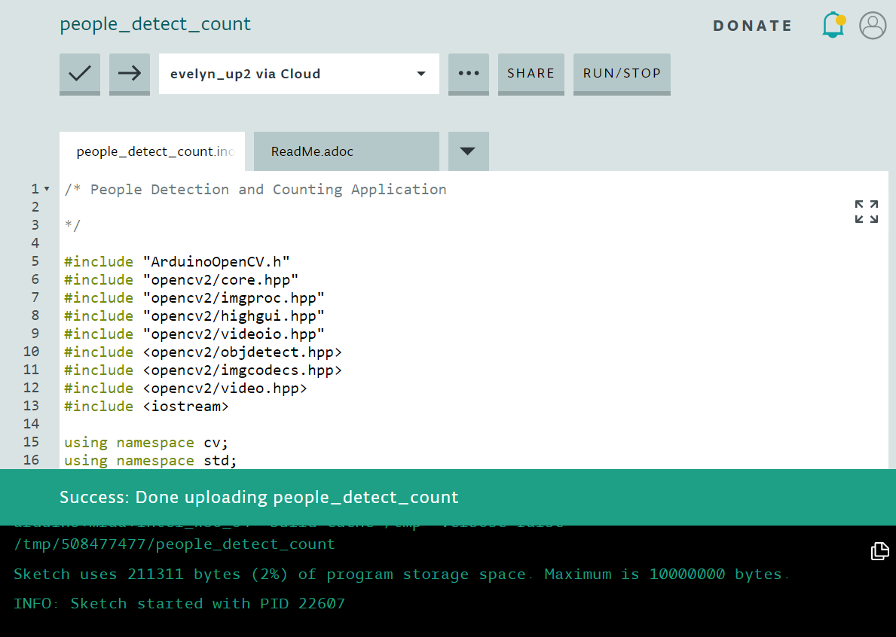

# People Counter in C++/OpenCV for Arduino Create IDE 

## Introduction
A people counter is a solution that counts (or measures) the number of people who enter a designated area. You may be familiar with people counting systems, found in small shops, libraries and convenience stores, that use infrared sensors to detect people. When an infrared beam is cut (a person intercepts it by entering or exiting a door for example) the system increments a count. This technology has limitations when it comes to instances of occlusion (when one person A blocks person B and person B doesn't get counted). An appropriately designed computer vision-based people counting system can be more robust in handling cases of occlusion. Here we utilize the OpenCV libraries and apply the Histograms of Oriented Gradients (HOG) algorithm to create a computer vision application for people detection/counting.

## What you’ll learn
* How to build people counting computer vision application from source code in the Arduino Create IDE.
* How to run the application from the command prompt on the Ubuntu desktop.

## Gather your materials
  *	[UP Squared board](http://www.up-board.org/upsquared/) (tested hardware)
  *	Ubuntu 16.04
  * OpenCV version 3.3.0
  *	A UVC webcam

[Click here for instructions on how to set up the OpenCV libraries on your hardware.](https://github.com/intel-iot-devkit/up-squared-grove-IoT-dev-kit-arduino-create/tree/master/examples/OpenCV-Setup)

## Get the Code
Open the example in the Arduino Create IDE. Navigate to `Examples > FROM LIBRARIES > UP SQUARED GROVE IOT DEV KIT > OpenCV-PeopleCounter`.


### Verify
[//]: # (insert screenshot of "done verifying...")


### Upload

[//]: # (insert screenshot of "done uploading...")



### Run the Application

**Note**: make sure you've plugged in a UVC webcam before attempting to run the application

After successfully uploading the sketch to the target hardware, a *sketches* folder will be created in the *Home* directory on the Ubuntu desktop (where the Arduino Create IDE places the compiled code). Because the sketches folder is protected, You'll need to run the application as root user.

```
sudo su
cd sketches
```
```
./OpenCV-PeopleCounter
```

A window should pop up and when a person is detected, you'll see a green bounding box around the person. And the terminal displays the "People count" as a numerical value (for example, 2).

## How it works
The people counter/detector uses Histograms of Oriented Gradients (HOG), a type of "feature descriptor", to achieve object detection. A feature descriptor (an algorithm) encodes information from an image or video into numerical values. Those values are then used to distinguish one feature from another (to make the task of classification easier). HOG features are calculated... 

HOG appears in the code as `HOGDescriptor hog; hog.setSVMDetector(HOGDescriptor::getDefaultPeopleDetector());`

Read more about the [HOG descriptor class](https://docs.opencv.org/3.1.0/d5/d33/structcv_1_1HOGDescriptor.html) at opencv.org.

[//]: # ()

