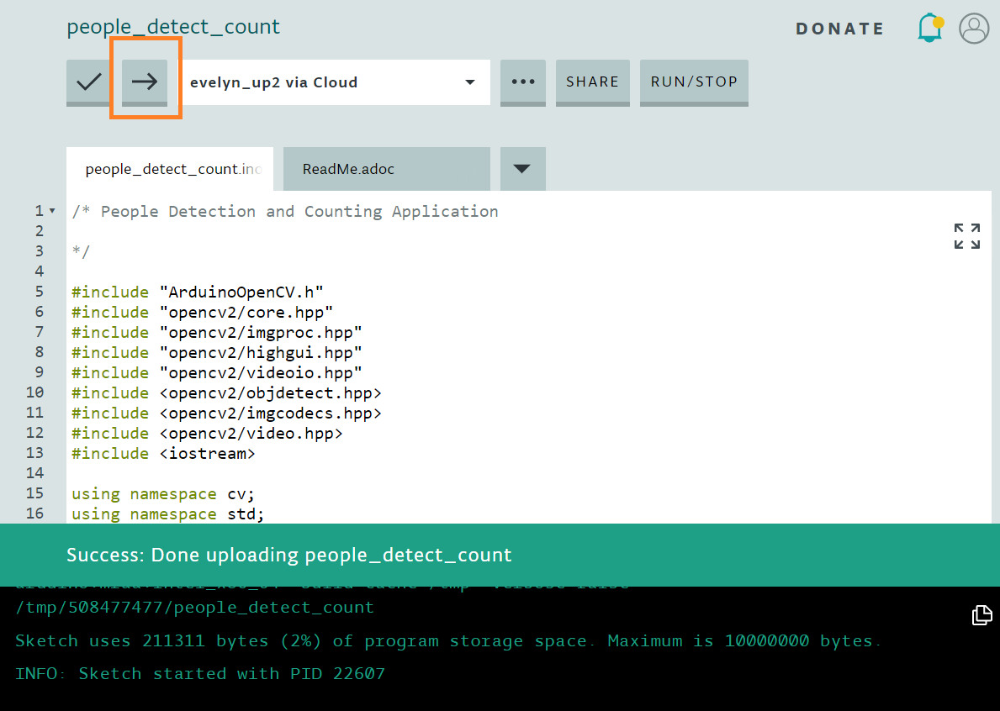
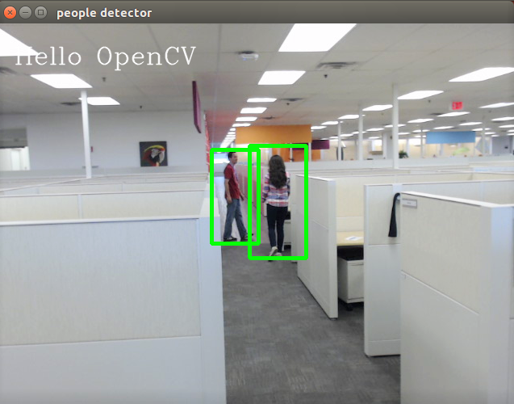
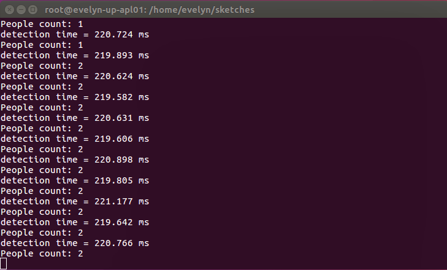

# People Counter

## Introduction
A people counter is a solution that counts (or measures) the number of people who enter a designated area. You may be familiar with people counting systems, found in small shops, libraries and convenience stores, that use infrared sensors to detect people. When an infrared beam is cut (a person intercepts it by entering or exiting a door for example) the system increments a count. This technology has limitations when it comes to instances of occlusion (when one person A blocks person B and person B doesn't get counted). An appropriately designed computer vision-based people counting system can be more robust in handling cases of occlusion. Here we utilize the OpenCV libraries and apply the Histograms of Oriented Gradients (HOG) algorithm to create a computer vision application for people detection/counting.

## What you’ll learn
* How to run a basic people counter computer vision application

## Gather your materials
  *	[UP Squared\* board](http://www.up-board.org/upsquared/) (tested hardware)
  *	Ubuntu\* 16.04
  * OpenCV version 3.3.0
  *	A UVC webcam

[Click here for instructions on how to set up the OpenCV libraries on your hardware.](https://github.com/intel-iot-devkit/up-squared-grove-IoT-dev-kit-arduino-create/tree/master/examples/OpenCV-Setup)

## Get the Code
To open the example in the Arduino Create\* IDE, navigate to `Examples > FROM LIBRARIES > UP SQUARED GROVE IOT DEV KIT > OpenCV-PeopleCounter`.

**Note**: if you haven't already done so, connect to your Intel®-based platform through Arduino Create. For instruction on how to perform this task, see the [Arduino Create Get Started Guide](https://software.intel.com/en-us/arduino-create-for-intel-based-platforms-getting-started-guide-connect-to-target-platform).

### Verify


### Upload



### Run the Application

**Note**: make sure you've plugged in a UVC webcam before attempting to run the application

After successfully uploading the sketch to the target hardware, a *sketches* folder will be created in the *Home* directory on the Ubuntu desktop (where the Arduino Create IDE places the compiled code). Because the sketches folder is protected, You'll need to run the application as root user.

```
sudo su
cd sketches
./OpenCV-PeopleCounter
```

Two windows should pop up on the desktop (one for the webcam video and a terminal window for displaying numerical values). When a person is detected, you'll see a green bounding box around that person. And the terminal displays the "People count" as an integer value (person count per frame).





## How it works
The people detector portion of the code uses Histograms of Oriented Gradients (HOG), a type of "feature descriptor", to achieve object detection. A feature descriptor (an algorithm) encodes information from an image or video into numerical values. Those values are then used to distinguish one feature from another (to make the task of classification easier). 

In the code sample (.ino file), we initialize the HOG object with `HOGDescriptor hog;` and then instruct the HOG object to use a default people counter `hog.setSVMDetector(HOGDescriptor::getDefaultPeopleDetector());`. For each frame in the video capture, we perform the detection of people (our object) with `hog.detectMultiScale` (below `int detectAndDraw(const HOGDescriptor &hog, Mat &img)`) and then a rectangle (green) is drawn around that detected person starting from `for(size_t i = 0; i < found.size(); i++ )`. To count the number of rectangles (which corresponds to a detected a person), we use `int num_people = detectAndDraw(hog, image)`.

Because we take advantage of an already existing (default) detector (here, we don't actually build an object detector from scratch), we don't provide an in-depth explanation of the HOG object. Most of the work is taken care of by the OpenCV libraries and that means the sample code is high-level (the details are abstracted from your view as the user).

### About HOG
Here, "histogram" refers to a distribution (for example, a cluster of similar things, such as edges), "oriented" means directions and "gradients" refer to x, y derivatives (as in calculus, we’re looking for slopes here). Two types of gradients are used as features: edges (which include curves) and intensity. Curves and edges are the main idea for this type of problem (detection of objects such as people), and for HOG filter approaches in general. And a HOG filter is a linear classifier, which means that it’s very good at sorting things into “buckets” based on multi-dimensional features (such as curves and edges).

Read more about the [HOG descriptor class](https://docs.opencv.org/3.1.0/d5/d33/structcv_1_1HOGDescriptor.html) at opencv.org.

IMPORTANT NOTICE: This software is sample software. It is not designed or intended for use in any medical, life-saving or life-sustaining systems, transportation systems, nuclear systems, or for any other mission-critical application in which the failure of the system could lead to critical injury or death. The software may not be fully tested and may contain bugs or errors; it may not be intended or suitable for commercial release. No regulatory approvals for the software have been obtained, and therefore software may not be certified for use in certain countries or environments.
